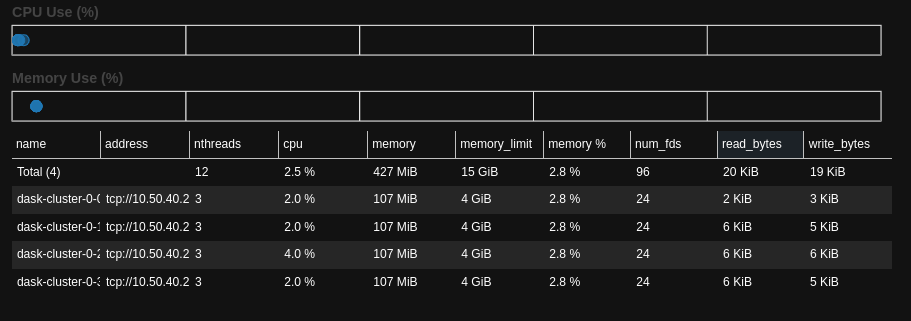
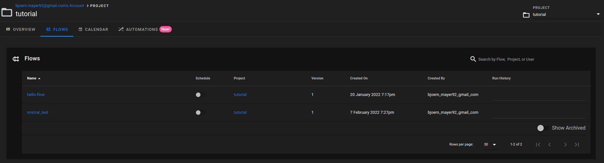
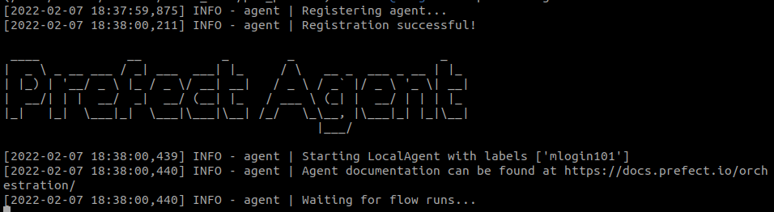
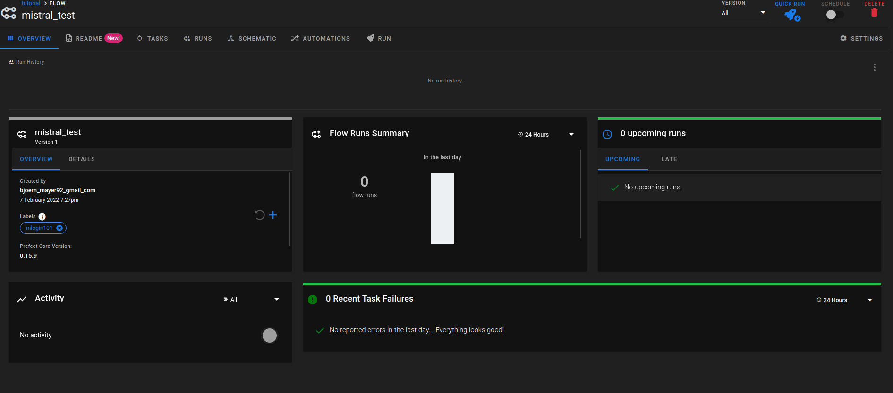

## Welcome to GitHub Pages
Guide on how to run prefect workflows on a dask slurmcluster deployed on Mistral from DKRZ ([Link](https://docs.dkrz.de/doc/mistral/index.html)) 


# Setting up Slurm Clsuter

Use either jupyterhub([Link](https://jupyterhub.dkrz.de/)) to start a dask slurm cluster or run it as a script [Link](./src/start_dask_slurmcluster.py) on mistral directly. For more info check [Link](https://docs.dkrz.de/blog/2020/dask_jobqueue.html)
```markdown
cluster = SLURMCluster(name=name,
                       queue = queue,
                       project= project,
                       cores=cores, 
                       interface=interface,
                       memory=memory,
                       walltime = walltime,
                       scheduler_options={"dashboard_address": ":{}".format(str(port))})

client = Client(cluster)

cluster.scale(workers)
```
When using jupyterhub you should be able to view the dashboard directly in the browser. When running a cluster in the terminal you need to forward the port via ssh tunneling to your local PC and should then be able to view the dask dashboard.

The output of client should look similar to this:



# Setting up Prefect
## Set up the prefect cloud
Setting up the prefect cloud follows this tutorial [Link](https://docs.prefect.io/orchestration/getting-started/set-up.html#set-the-prefect-cloud-backend)
### Set the prefect cloud backend
```markdown
prefect backend cloud
```
### Login in
For this example we will use the cloud solutio provided by prefect. But also setting up your own prefect server will work. First we need to create an account and log in to
https://cloud.prefect.io/
### Setting up the API key
For authentication we will need to generate an authentication key here : [Link](https://cloud.prefect.io/user/keys). The newly created key will be copied and stored for use by:
```markdown
prefect auth login --key <YOUR-KEY>
```
### Create a new projects
```markdown
prefect create project "tutorial"
```
## Register a flow
We can now register a flow for this project with the general structure of prefect:
```markdown
    from prefect.engine.executors import DaskExecutor

    dask_executor = DaskExecutor(address = cluster_address)
    with Flow("mistral_test", executor = dask_executor) as flow:
        <flow description>

    flow.register(project_name = project)

```
Here cluster address is the address of our Slurm cluster set up at the beginning and project the name of our porject ("tutorial"). An example script can be found here: [Link](./src/dask_cluster.py) and run via the following command:
```markdown
    python dask_cluster.py --cluster=<cluster_address> --project="tutorial"

```
The registered flow in the cloud should now be visible:


## Register an Agent
Finally we need to register mistral as an agent for our workflow. This can be done in one line:
``` markdown
    prefect agent local start

```
The output of the command should look like this:


### Running the flow
After the setup your flow should show the registered agent on the left side:

